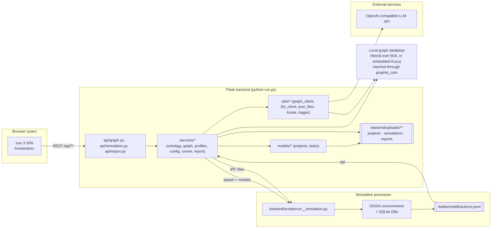
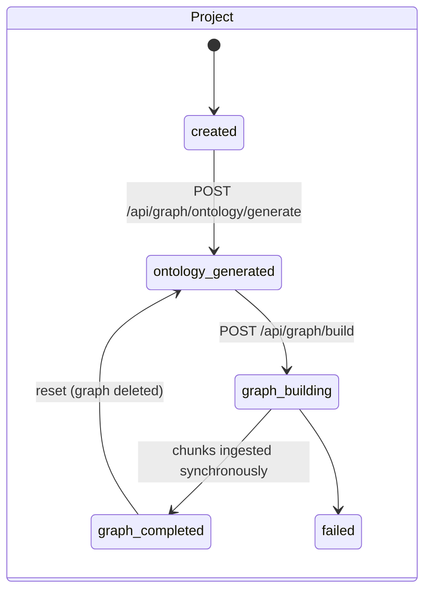
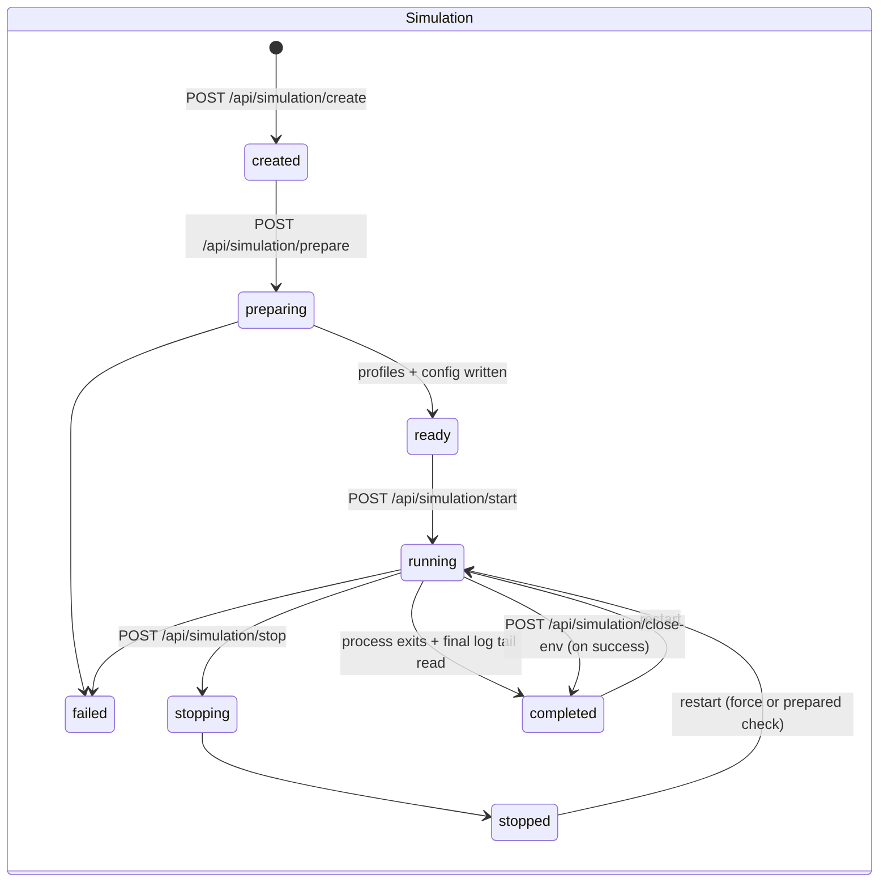
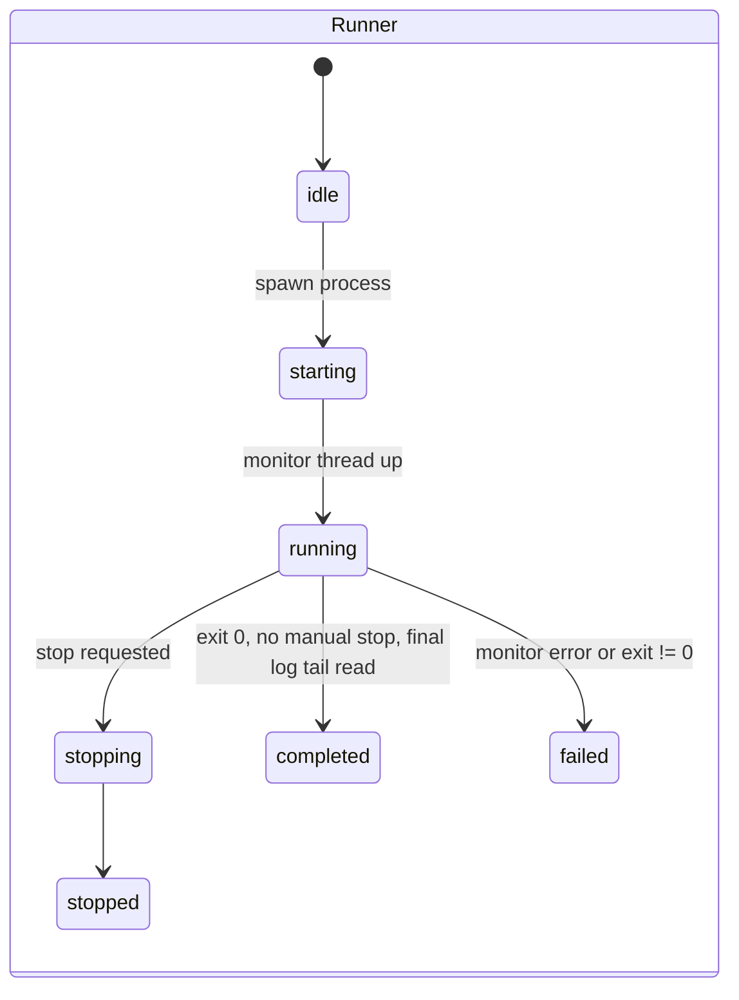
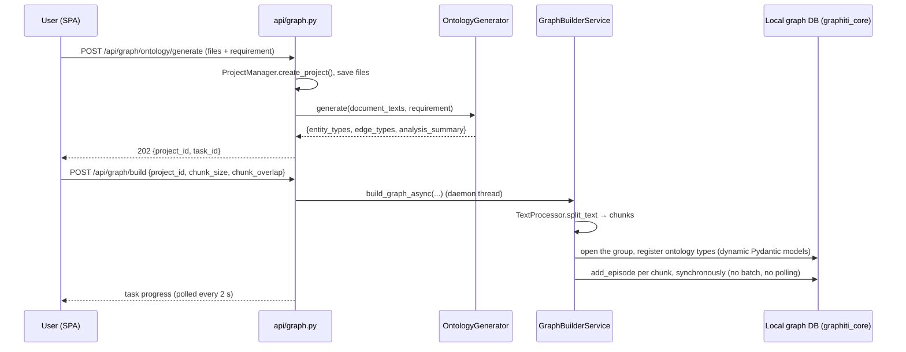
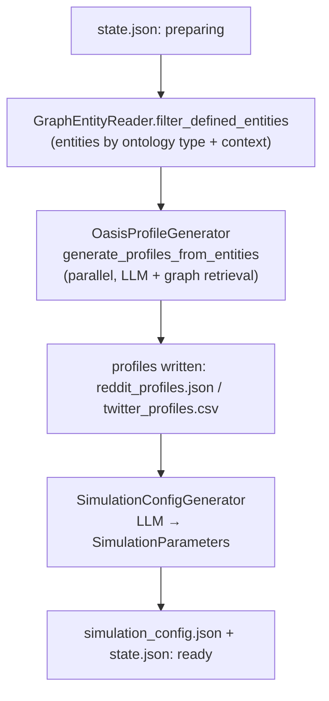
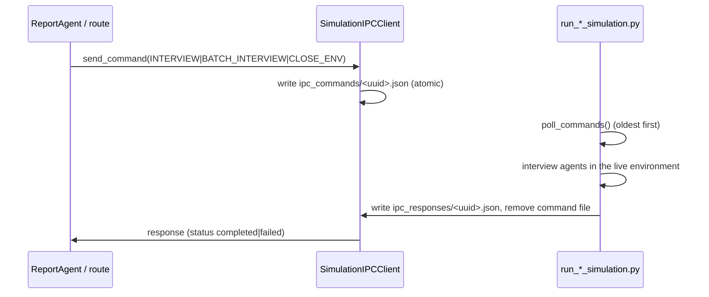

# MiroFish — Design Document

> Audience: engineers maintaining or extending MiroFish.
> Companion documents: [`README.md`](../README.md) (overview), [`CHANGELOG.md`](../CHANGELOG.md)
> (change history, including the reviewed-and-open defects), [`docs/USER_GUIDE.md`](USER_GUIDE.md)
> (non-technical usage).

## 1. Purpose

MiroFish turns unstructured seed material (news reports, policy drafts, novels, research
summaries) into a *runnable social simulation* and then into a report about it:

1. Extract an **ontology** (entity/edge types) from the documents and the user's prediction
   requirement.
2. Build a **knowledge graph** in a local, in-process GraphRAG store (`graphiti_core`) with temporal memory.
3. Turn the graph's entities into **agents** with LLM-generated personas, and generate the
   simulation parameters (world clock, per-agent activity, recommendation weights, initial
   events).
4. Run the agents on an **OASIS** social-media environment (Twitter-like and Reddit-like
   platforms) in parallel processes and collect every action as an append-only log.
5. Let a **ReportAgent** interrogate the post-simulation world with a small tool suite and
   write a sectioned report, and let a human **interview** individual agents.

Design priorities, in order: correctness of persisted state, reproducibility of a run,
resilience against LLM/provider misbehaviour, and only then throughput.

## 2. Glossary

| Term | Meaning in this codebase |
| --- | --- |
| **Seed / 现实种子** | The uploaded documents plus the natural-language prediction requirement. |
| **Ontology / 本体** | `{entity_types, edge_types, analysis_summary}` — the schema and prompt contract for graph extraction. |
| **Project** | Server-side container for one upload: files, extracted text, ontology, graph id. Persisted as `project.json`. |
| **Graph** | A graph in the local graph database, addressed by its group id (`mirofish_<hex>`); the GraphRAG store. |
| **Entity / Node** | A graph node with a `name`, `summary`, `labels` (ontology type) and attributes. |
| **Fact / Edge** | A temporal fact between two nodes with `valid_at` / `invalid_at` / `expired_at`. |
| **Simulation** | One environment built from a graph: profiles + config + optionally running processes. |
| **Agent / Profile** | A simulated individual derived from one entity (persona, activity, stance, influence). |
| **Platform** | `twitter` (“Info Plaza / 世界1”) or `reddit` (“Topic Community / 世界2”), or `parallel` for both. |
| **Action** | One agent behaviour (`CREATE_POST`, `LIKE_POST`, …) recorded in `actions.jsonl`. |
| **Run** | One execution of the simulation processes; its live state is `run_state.json`. |
| **Report** | A generated document for a finished (or running) simulation, split into sections. |
| **Interview** | A request/response exchange with a live agent over the file IPC protocol. |

## 3. System topology



Three moving parts exchange state through the file system, the local graph database and
the LLM API:

* the **Flask backend** owns all state and HTTP surface;
* one **simulation process pair** per run (or a single dual-platform process) owns the live
  OASIS environments and the on-disk SQLite databases;
* the **local graph database** (Neo4j, or embedded Kuzu, reached through `graphiti_core`) owns the knowledge graph and its derived memory.

## 4. Repository layout

```
backend/
  run.py                     # entry point: validate config, create_app(), serve on :5001
  app/
    __init__.py              # create_app(): CORS, blueprints, request logging, /health
    config.py                # Config (loads .env from the repo root), validate()
    models/                  # Project/ProjectManager, Task/TaskManager (in-memory)
    api/                     # graph.py, simulation.py, report.py (Flask blueprints)
    services/                # ontology, graph build, profiles, config gen, runner, report,
                             # graph_tools, graph_entity_reader, ipc
    utils/                   # llm_client, graph_client (+lifecycle), json_files, locale,
                             # logger, file_parser, ontology, openai_chat_compat, retry
  scripts/                   # run_*_simulation.py (OASIS), action_logger.py, test_profile_format.py
  tests/                     # pytest suite (see AGENTS.md section 2 for the required check)
frontend/                    # Vue 3 + vite + vue-i18n + d3 SPA (:3000, proxies /api)
locales/                     # zh.json / en.json / languages.json (shared backend + frontend)
scripts/                     # repo star-history tooling (CI, unrelated to the product)
tests/                       # star-history test suite
```

## 5. Runtime components

### 5.1 Flask application (`app/__init__.py`)

`create_app(config_class=Config)` builds the app with CORS for `/api/*`, disables ASCII
JSON escaping, registers the three blueprints, and registers
`SimulationRunner.register_cleanup()` so `SIGTERM`/`atexit` terminate child processes.
Logging is configured by `utils/logger.setup_logger()` (rotating file + console).

Long-running work always runs in **daemon threads** started by the routes, reporting
progress through the in-memory `TaskManager` (tasks are lost on restart — deliberate: they
describe in-flight work, not durable state).

### 5.2 Frontend (`frontend/src`)

Vue 3 (`<script setup>`), vue-router (history mode), vue-i18n (composition API, default
`zh`, fallback `zh`), axios (single instance in `api/index.js` with an interceptor that
unwraps `{success, data}` and promotes `error` strings onto `error.message`), and d3 for the
force-directed graph panel. All server interaction goes through
`api/{graph,report,simulation}.js`; all user-visible strings come from `locales/*.json`
(628 keys, identical key sets in both locales).

Routes → views:

| Route | View | Step |
| --- | --- | --- |
| `/` | `Home.vue` | upload seed + requirement |
| `/process/:projectId` | `MainView.vue` | 1 · graph build |
| `/simulation/:simulationId` | `SimulationView.vue` → `Step2EnvSetup.vue` | 2 · environment setup |
| `/simulation/:simulationId/start` | `SimulationRunView.vue` → `Step3Simulation.vue` | 3 · run |
| `/report/:reportId` | `ReportView.vue` → `Step4Report.vue` | 4 · report |
| `/interaction/:reportId` | `InteractionView.vue` → `Step5Interaction.vue` | 5 · deep interaction |

Polling cadences: graph task 2 s, project/graph 10–30 s, prepare status 2 s,
profiles/config 2–3 s, run status 2 s + detail 3 s, report agent-log 2 s, console-log 1.5 s.
Every timer is cleared on unmount and every start function is idempotent.

### 5.3 Simulation processes (`backend/scripts/`)

`run_twitter_simulation.py`, `run_reddit_simulation.py` and
`run_parallel_simulation.py` take `--config <simulation_config.json>` (plus optional
`--max-rounds`), build the OASIS environments, inject personas, publish the configured
initial posts, then step the environment round by round. Actions are appended to
`twitter/actions.jsonl` / `reddit/actions.jsonl`; the process keeps the environment alive
after the last round so interviews can still be served.

## 6. Domain model and state machines







Report status: `pending → planning → generating → completed | failed`.
Task status (in-memory): `pending → processing → completed | failed`.

## 7. Persistence and concurrency

### 7.1 On-disk layout (all under `backend/uploads/`, git-ignored)

```
uploads/
  projects/<project_id>/
    project.json                 # Project dataclass (atomic writes)
    files/<hex>.<ext>            # raw uploads (original names are metadata only)
    extracted_text.txt           # concatenated text used for chunking
  simulations/<sim_id>/
    state.json                   # SimulationState (atomic writes)
    reddit_profiles.json         # agent personas (JSON)
    twitter_profiles.csv         # agent personas (OASIS CSV contract)
    simulation_config.json       # time/agent/event/platform parameters
    simulation.log               # child stdout+stderr captured by the parent
    log/simulation.log           # child's own file logger (parallel runner)
    twitter/actions.jsonl        # append-only action log
    reddit/actions.jsonl
    twitter_simulation.db        # OASIS SQLite state (posts/comments/…)
    reddit_simulation.db
    run_state.json               # SimulationRunState (atomic writes)
    ipc_commands/, ipc_responses/ # interview protocol
    env_status.json              # simulation-side liveness flag
  reports/<report_id>/
    meta.json, outline.json, progress.json   # atomic writes
    section_NN.md, full_report.md
    agent_log.jsonl, console_log.txt
```

### 7.2 Concurrency invariants

These are load-bearing; keep them when extending the code.

1. **State files are written atomically and read tolerantly.** Use
   `utils.json_files.write_json_atomic()` / `read_json()` for every JSON state file that a
   request thread may read while a worker thread writes it. Never reintroduce plain
   `open(path, 'w') + json.dump`. `os.replace` needs a brief exclusive window on Windows,
   hence the bounded retry on both sides.
2. **Every caller-supplied id that reaches a path is validated.**
   `report_agent.ReportManager.is_valid_report_id()` and
   `simulation_manager.is_valid_simulation_id()` accept a single path segment
   (`^[A-Za-z0-9_-]+$`). The simulation blueprint additionally rejects bad ids in a
   `before_request` hook so no route can forget. Path-building helpers
   (`_get_report_folder`, `_get_simulation_dir`) raise `ValueError` as a last line of defence.
3. **Read paths never create directories.** `_get_simulation_dir(..., create=False)` is used
   by every read; only write paths (`create=True`, the default) create the directory.
4. **Append-only logs are tailed by byte offset, complete lines only.**
   `SimulationRunner._read_action_log()` opens the log in binary mode, consumes only lines
   terminated by `\n`, and always advances the offset. A partially written trailing line is
   left for the next poll. Per-line failures (bad JSON, unexpected field type) are logged
   and skipped — the offset must never rewind, otherwise that record would be replayed.
5. **A monitor starts where the current run starts.** `_monitor_simulation()` initialises
   its offsets to the current size of each `actions.jsonl`, so restarting a simulation does
   not replay the previous run's actions into counts or into the graph.
6. **Per-graph lifecycle lock** (`utils/graph_lifecycle.py`): an `RLock` per graph id,
   re-entrant so a caller can hold it across a consumer check and the graph mutation.
   Report generation registers itself as a *graph reader* for the lifetime of the report;
   graph reset/delete refuses while readers or active simulations exist (`GraphInUseError`).
7. **Per-simulation finalization barrier**
   (`SimulationRunner._finalization_lock`): manual stop and natural process exit can observe
   the same exit; the lock serialises the terminal state write so exactly one path owns the
   final result.
8. **A simulation never writes back to its graph.** Nothing in the run path constructs a
   graph writer: there is no request field, no runner parameter and no registry for one. The
   only graph mutation the product performs is the seed ingestion of Pipeline 1 (§8); report and
   interview traffic against a live simulation is read-only with respect to the graph.
9. **Progress objects are snapshots.** `TaskManager.get_task()` returns a copy; routes never
   iterate or serialise an object that a worker thread is mutating.

### 7.3 What is *not* durable

* `TaskManager` contents (progress of in-flight work) — lost on restart; the durable
  equivalents are `state.json`, `run_state.json` and `progress.json`.
* Per-process id-keyed lock maps (`_build_locks`, `_graph_locks`, `_finalization_locks`) —
  process-local and never pruned (see `CHANGELOG.md` → Known issues).

## 8. Pipeline 1 — seed → ontology → graph



Details that matter:

* **Chunking** (`utils/file_parser.split_text_into_chunks`): `chunk_size`/`overlap` are
  validated (`0 <= overlap < chunk_size`); a sentence boundary is only accepted when it
  advances past the overlap window, which guarantees termination for every input.
  `/api/graph/build` validates the same bound and rejects bad values with `400`.
* **Ontology adaptation** (`services/ontology_generator.py`): LLM output is normalized —
  names PascalCased, duplicates dropped, attributes normalized and capped
  (`MAX_ONTOLOGY_ATTRIBUTES = 10`), types capped at `MAX_ONTOLOGY_TYPES = 10`, and the
  `Person`/`Organization` catch-all types are always present (the cap preserves them).
  Long documents are compressed into representative chunks before the LLM call.
* **Synchronous ingestion** (`services/graph_builder.py`): one `graph_client.add_episode`
  call per chunk, in pages of 200 (`PAGE_SIZE`). The call returns only once the episode and
  its nodes and edges are written, so the build worker owns the whole write and a stored
  episode is queryable immediately: there is no batch id, no operation-id reconciliation, no
  resume path and no deadline.

## 9. Pipeline 2 — environment setup

`POST /api/simulation/prepare` (idempotent: `_check_simulation_prepared` short-circuits) runs
in a daemon thread:



* `SimulationParameters` = `time_config` (total hours, minutes per round, active agents per
  hour, peak/off-peak/morning/work multipliers), `agent_configs` (per-agent activity level,
  posts/comments per hour, active hours, response delay, sentiment bias, stance, influence),
  `event_config` (initial posts, scheduled events, hot topics, narrative direction) and
  `twitter_config`/`reddit_config` (recency/popularity/relevance weights, viral threshold,
  echo-chamber strength).
* The prepared check requires `simulation_config.json` plus the profile file of every
  **enabled** platform — single-platform simulations are first-class.
* `Config.OASIS_SIMULATION_DATA_DIR` is the only simulation root; profiles and config are
  read back by `/profiles`, `/profiles/realtime`, `/config/realtime`.

## 10. Pipeline 3 — running a simulation

`POST /api/simulation/start` → `SimulationRunner.start_simulation()`:

1. Validate `platform ∈ {twitter, reddit, parallel}` and `max_rounds`; refuse with `400`
   (or `409` when a previous run has not finished finalizing) if the target is not ready.
2. Spawn `python run_<platform>_simulation.py --config <sim>/simulation_config.json` with
   `cwd=<sim_dir>`, `PYTHONUTF8=1`, `start_new_session=True`, `stdout/stderr` captured into
   `<sim_dir>/simulation.log`.
3. Publish process handle + run state atomically, then start the daemon monitor:
   `_monitor_simulation()` polls every 2 s, tails both action logs by byte offset, updates
   `SimulationRunState` (rounds per platform, action counts, simulated hours, recent actions)
   and re-persists `run_state.json`.
4. On `simulation_end`, `_check_all_platforms_completed()` is consulted, but the terminal
   status is only published in the `finally` block, under the finalization lock, after the
   process exited and the final action-log tail was read.
5. Action records are only counted and served (`/run-status`, `/actions`, `/timeline`,
   `/agent-stats`). They are never written back to the graph (§7.2 invariant 8).

Interviews (`/api/simulation/interview*`) run through the file IPC protocol:



**Result-key contract.** A dual-platform process returns
`{"twitter_<id>": …, "reddit_<id>": …}`; the single-platform scripts return `{"<id>": …}`.
`graph_tools.interview_agents()` accepts both and reports an explicit failure when no reply is
available, instead of inventing conversation content.

## 11. Pipeline 4 — report generation

`POST /api/report/generate` mints `report_<hex12>`, registers the report as a graph reader
(so graph reset/delete is blocked), then runs `ReportAgent.generate_report()` in a daemon
thread:

1. **Outline** — `plan_outline()` via `LLMClient.chat_json()` → `ReportOutline` with sections.
2. **Sections** — for each section a bounded ReACT loop (`MAX_TOOL_CALLS_PER_SECTION = 5`)
   with four tools: `insight_forge` (deep causal analysis), `panorama_search` (breadth over
   all nodes/edges), `quick_search` (GraphRAG lookup), `interview_agents` (live agents).
   Tool calls are parsed from `<tool_call>` blocks or bare JSON and validated before use;
   fabricated `<tool_result>` blocks are stripped from the model's own output.
3. **Persistence** — after each section: `section_NN.md`, `progress.json`, `agent_log.jsonl`;
   the frontend polls sections directly, so the UI streams the report as it is written.
4. **Assembly** — `assemble_full_report()` concatenates the section files and
   `_post_process_report()` fixes heading levels, removes duplicated section titles and
   collapses blank runs.

`/api/report/chat` reuses the same tool loop for ad-hoc questions and resolves *the newest*
report of a simulation (`ReportManager.get_report_by_simulation`).

## 12. HTTP API surface

All responses are `{success: bool, data|error: …}`; errors never contain tracebacks.
The `/api/simulation` blueprint rejects non-id `simulation_id` values with `404` before any
route runs, and `/api/report` validates `report_id` in the manager.

### `/api/graph`

| Method | Path | Purpose |
| --- | --- | --- |
| POST | `/ontology/generate` | upload seed files + requirement, create project, generate ontology (async) |
| POST | `/build` | build the local graph for a project (async task) |
| GET | `/task/<task_id>`, `/tasks` | task progress |
| GET | `/project/<project_id>`, `/project/list` | project metadata |
| POST | `/project/<project_id>/reset` | reset ontology/graph reference |
| DELETE | `/project/<project_id>`, `/delete/<graph_id>` | delete project / graph (refused while in use) |
| GET | `/data/<graph_id>` | graph payload for the d3 panel |

### `/api/simulation`

| Method | Path | Purpose |
| --- | --- | --- |
| GET | `/entities/<graph_id>[/…]` | entity browsing/filtering |
| POST | `/create` | create a simulation from a project's graph |
| POST | `/prepare`, `/prepare/status` | generate profiles + config (async, idempotent) |
| GET | `/<simulation_id>`, `/list`, `/history` | state / listing / history database |
| GET | `/<id>/profiles`, `/profiles/realtime`, `/config`, `/config/realtime` | generated artefacts |
| GET | `/<id>/config/download`, `/script/<name>/download` | downloads (allow-listed) |
| POST | `/generate-profiles` | personas without creating a simulation |
| POST | `/start`, `/stop`, `/close-env`, `/env-status` | run lifecycle |
| GET | `/<id>/run-status`, `/run-status/detail`, `/actions`, `/timeline`, `/agent-stats` | live run data |
| GET | `/<id>/posts`, `/comments` | OASIS SQLite content (`platform` whitelisted) |
| POST | `/interview`, `/interview/batch`, `/interview/all`, `/interview/history` | agent interviews |

### `/api/report`

| Method | Path | Purpose |
| --- | --- | --- |
| POST | `/generate`, `/generate/status` | start / poll report generation |
| GET | `/<report_id>`, `/list`, `/by-simulation/<sim_id>`, `/check/<sim_id>` | report lookup |
| GET | `/<report_id>/progress`, `/sections`, `/section/<n>`, `/download` | streaming report content |
| GET | `/<report_id>/agent-log[/stream]`, `/console-log[/stream]` | generation logs |
| DELETE | `/<report_id>` | delete a report |
| POST | `/chat` | talk to the ReportAgent |
| POST | `/tools/search`, `/tools/statistics` | direct graph tool access |

## 13. Configuration

`app/config.py` loads `<repo root>/.env` (override) at import time. `Config.validate()`
rejects a missing `LLM_API_KEY`, a `GRAPH_BACKEND` other than `neo4j`/`kuzu`, and a missing
`NEO4J_PASSWORD` when the backend is Neo4j. `../.env.example` is the authoritative template.

| Key | Default | Notes |
| --- | --- | --- |
| `LLM_API_KEY` / `LLM_BASE_URL` / `LLM_MODEL_NAME` | — / OpenAI / `gpt-4o-mini` | any OpenAI-compatible endpoint |
| `LLM_BOOST_*` | unset | optional second provider; **presence** enables it for one platform |
| `GRAPH_BACKEND` | `neo4j` | `neo4j` or `kuzu`; anything else fails validation |
| `NEO4J_URI` / `NEO4J_USER` / `NEO4J_PASSWORD` | `bolt://localhost:7687` / `neo4j` / — | required when `GRAPH_BACKEND=neo4j` |
| `KUZU_DB_PATH` | `backend/uploads/graph.kuzu` | file path for the embedded backend |
| `EMBEDDING_MODEL_NAME` / `EMBEDDING_DIM` | `text-embedding-3-small` / `1024` | vectors written into the graph must match |
| `FLASK_HOST` / `FLASK_PORT` / `FLASK_DEBUG` | `0.0.0.0` / `5001` / `False` | `run.py` |
| `OASIS_DEFAULT_MAX_ROUNDS` | `10` | round cap when the request omits `max_rounds` |
| `REPORT_AGENT_MAX_TOOL_CALLS` / `_MAX_REFLECTION_ROUNDS` / `_TEMPERATURE` | 5 / 2 / 0.5 | *not yet honoured* — the report agent currently uses class constants; see Known issues |

Other Config constants: `MAX_CONTENT_LENGTH = 50 MB`, allowed uploads
`pdf|md|txt|markdown`, `DEFAULT_CHUNK_SIZE = 500`, `DEFAULT_CHUNK_OVERLAP = 50`. The graph
client bounds every read and search (`utils/graph_client.py`): `PAGE_SIZE = 200`,
`MAX_SEARCH_QUERY_CHARS = 400`, `MAX_SEARCH_RESULTS = 50`, `DEFAULT_SEARCH_LIMIT = 10`.

## 14. Observability

* `utils/logger.py` — rotating file handler (`backend/logs/YYYY-MM-DD.log`, 10 MB × 5) plus
  console; named loggers (`mirofish.api`, `mirofish.simulation`, `mirofish.graph`, …).
* `ReportLogger` — per-report `agent_log.jsonl` (tool calls, LLM responses, section
  completions) served by `/<report_id>/agent-log`.
* `ReportConsoleLogger` — per-report `console_log.txt`; note the handler is attached to
  process-global loggers (Known issues).
* `SimulationRunner` — `<sim_dir>/simulation.log` (child stdout/stderr) and
  `<sim_dir>/log/*.log` (child loggers), served to the UI.
* `/health` — `{status, service}` for liveness probes.

## 15. Failure and recovery semantics

| Failure | Behaviour | Recovery |
| --- | --- | --- |
| LLM returns truncated/invalid JSON | `LLMClient.chat_json()` retries once without an output-token cap, then raises `LLMResponseError` | task marked `failed` with the message in `state.json`/task |
| Provider rejects `response_format` | one request without JSON mode (does not consume a content attempt) | transparent |
| Graph read fails (backend unreachable, auth, timeout) | raises `GraphClientError` — a read never degrades to an empty result | fix the backend and retry |
| Graph write fails mid-build | the build task fails carrying the error; the chunks already written stay in the graph | re-run `POST /build` with `force` after inspecting the log |
| Simulation process exits non-zero | monitor records the last 2 000 chars of `simulation.log`, run state `failed` | `POST /start` with `force` (stops + cleans logs) |
| Report generation aborted by an unexpected value | section loop is bounded; failure marks the report `failed`, written sections are kept | regenerate |
| Graph in use by a reader/simulation | `GraphInUseError` → `409`-style refusal | wait or stop the consumer |

## 16. Testing

* `backend/tests/` — pytest suite, all offline: the graph client and OpenAI are replaced by
  doubles/`SimpleNamespace` clients, state lives in `tmp_path`, Flask routes are exercised
  through either `create_app().test_client()` or `test_request_context` + direct view calls.
  Coverage focus: graph lifecycle and report/simulation barriers, ontology normalization,
  profile normalization, LLM JSON handling, path guards, atomic persistence, action-log
  tailing. See `AGENTS.md` section 2 for the required check.
* `tests/` — the repository's star-history tool suite (unrelated to the product), including
  CI-workflow assertions.
* No JavaScript test suite: the frontend contract is enforced by the type of work it does
  (polls documented endpoints) and by `npm run build`.

Guideline: tests assert observable behaviour (status codes, persisted state, propagated
errors), not implementation details. Every fixed defect above ships a regression test that
fails on the previous behaviour.

## 17. Extension points

| Goal | Touch points |
| --- | --- |
| New platform | `PlatformType`, `SimulationState.enable_*`, `backend/scripts/run_<platform>_simulation.py`, action-log path in `_monitor_simulation`, `_resolve_platform` whitelist, locales, `Step3Simulation.vue` cards |
| New report tool | `ReportAgent.VALID_TOOL_NAMES`, `_get_tools_description()`, `_execute_tool()`, `GraphToolsService`, `Step4Report.vue` result component |
| New ontology attribute/type rules | `utils/ontology.py` limits, `ontology_generator._validate_and_process()` |
| New durable state | add a JSON file, write it with `write_json_atomic`, read it with `read_json`, and decide who owns the lock |
| New locale | add `locales/<key>.json` (must match the `zh` key set exactly) and an entry in `locales/languages.json` |
| Swapping graph storage | `utils/graph_client.py` is the only module that talks to `graphiti_core`; services and routes call it, so a new backend changes that file and the `GRAPH_BACKEND` branch alone |

## 18. Open issues

See [`CHANGELOG.md`](../CHANGELOG.md) → *Known issues* for the reviewed-but-unfixed list
(unbounded id-keyed lock maps, cross-report console-log contamination, the 10 000-action
analysis cap, `insight_forge` per-node error swallowing, missing action logs for
single-platform runs, IPC response-file hygiene, and dead code kept intentionally).
